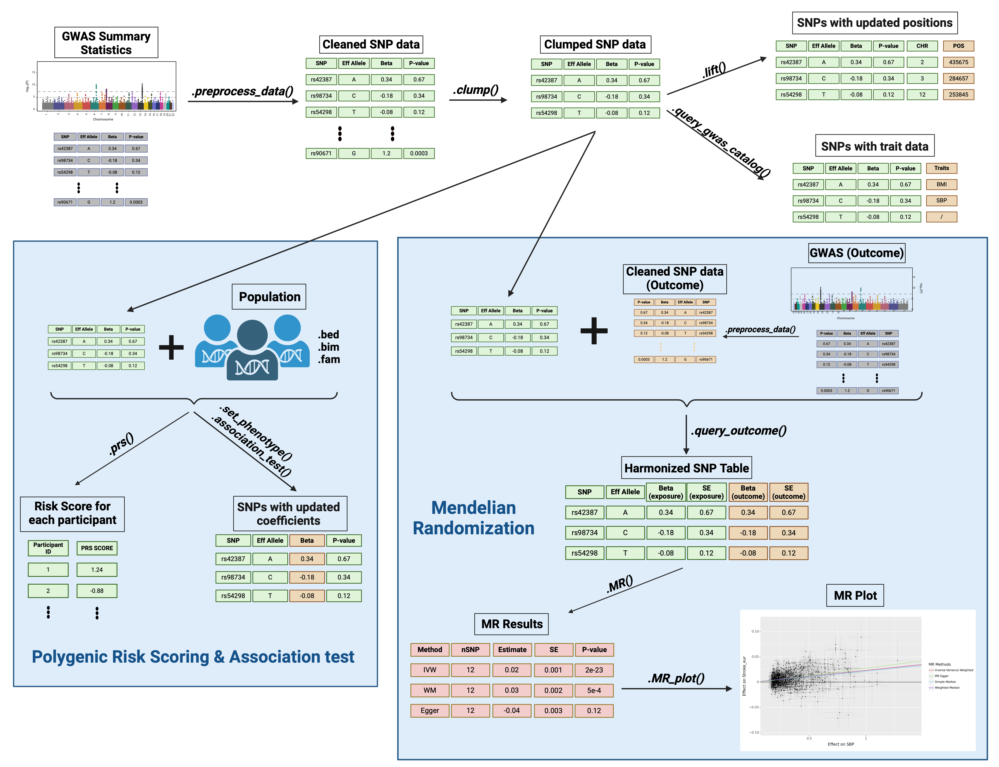

<div align="center">
  
  <h1>genal</h1>
  <p><b>Polygenic risk scoring (PRS) and Mendelian randomization (MR) in Python</b></p>
</div>


[](https://www.python.org/)
[](https://pypi.org/project/genal-python/)
[](https://genal.readthedocs.io)
[](https://doi.org/10.1093/bioadv/vbae207)

**Quick links**
- Documentation (tutorial + API): https://genal.readthedocs.io
- Introduction/tutorial page: https://genal.readthedocs.io/en/latest/introduction.html
- API reference: https://genal.readthedocs.io/en/latest/api.html
- Paper (citation): https://doi.org/10.1093/bioadv/vbae207

## What can you do with genal?
genal is built around one main object, `genal.Geno`, which wraps a pandas DataFrame of SNP-level data and provides end-to-end workflows:

- **Preprocess messy GWAS summary statistics**: validate/standardize columns and alleles; fill missing `SNP`, `CHR`, `POS`, `NEA`, `SE`, `P` using reference data.
- **Select independent instruments**: LD clumping (PLINK2).
- **Compute PRS**: weighted/unweighted scoring from PLINK genotype files, including optional **proxy SNP** support when variants are missing.
- **Run two-sample MR**: multiple methods + sensitivity analyses (heterogeneity, pleiotropy), with plotting utilities.
- **MR-PRESSO (parallel implementation)**: detect and correct horizontal pleiotropy.
- **Colocalization**: approximate Bayes-factor colocalization to assess whether two GWAS signals likely share a causal variant.
- **Association testing**: single-SNP regression in individual-level data (PLINK2) to recalibrate weights.
- **Utilities**: liftover between builds, GWAS Catalog querying, and filtering variants around a gene (useful for protein/drug-target analyses).

<details>
<summary>Flowchart (high-level pipeline)</summary>



</details>

## Install
```bash
pip install genal-python
```

```python
import genal
```

## Setup: PLINK + reference data
Many genal features rely on PLINK v2.0 (clumping, PRS, association testing, proxy search, allele-frequency updates).

```python
import genal

# Option 1: let genal download/install PLINK2 for your system (requires internet)
genal.install_plink()

# Option 2: point genal to an existing plink2 executable
genal.set_plink("/path/to/plink2")  # or "/path/to/folder/containing/plink2"
```
`genal` uses reference data in two different ways:

<details>
<summary>Types of reference data </summary>

### 1) Build-only reference (for preprocessing)

Used by: `Geno.preprocess_data()`.

- Purpose: fill/validate **rsIDs, CHR/POS, and alleles**.
- Argument: `reference_panel="37"` or `reference_panel="38"`.
- You can also provide a **custom reference** (DataFrame with the expected columns, or a `.bim`/`.pvar` path).


### 2) LD reference panel (for LD operations)

Used by: `Geno.clump()`, proxy search in `Geno.prs()` / `Geno.query_outcome()`, and `Geno.update_eaf()`.

- Purpose: derive LD (and/or allele frequency) from 1000G-like panels.
- Argument: `reference_panel="EUR_37"` (or `"AFR_38"`, etc.), or a path to a custom PLINK fileset.
- `genal` downloads built-in panels automatically the first time you use them.

</details>
<br>

By default, reference files are stored under `~/.genal/`, and temporary PLINK outputs go to `./tmp_GENAL/` (you can remove it with `genal.delete_tmp()`).

## Quickstart (GWAS → instruments → PRS → MR)
```python
import pandas as pd
import genal

# 1) Load exposure GWAS summary statistics into a DataFrame
exposure_df = pd.read_csv("exposure_gwas.tsv", sep="\t")
G_exposure = genal.Geno(
    exposure_df,
    CHR="CHR", POS="POS", SNP="SNP",
    EA="EA", NEA="NEA",
    BETA="BETA", SE="SE", P="P", EAF="EAF",
    keep_columns=False,
)

# 2) Basic cleaning + columns filling (build-only reference for rsID/alleles/coords)
G_exposure.preprocess_data(preprocessing="Fill_delete", reference_panel="37")

# 3) LD clumping to select independent instruments
G_instruments = G_exposure.clump(p1=5e-8, r2=0.01, kb=10000, reference_panel="EUR_37")

# 4) PRS in a target cohort (PLINK1 bed/bim/fam or PLINK2 pgen/pvar/psam)
# If genotype files are split by chromosome, use '$' as a placeholder.
G_instruments.prs(name="my_prs", path="my_genotypes_chr$")  # writes my_prs.csv

# 5) Two-sample MR 
# 5.1) Load outcome GWAS summary statistics into a DataFrame
outcome_df = pd.read_csv("outcome_gwas.tsv", sep="\t")
G_outcome = genal.Geno(outcome_df, CHR="CHR", POS="POS", EA="EA", NEA="NEA", BETA="BETA", SE="SE", P="P", EAF="EAF", keep_columns=False)

# 5.2) Clean and standardize outcome GWAS summary statistics
G_outcome.preprocess_data(preprocessing="Fill_delete", reference_panel="37")

# 5.3) Query outcome GWAS (optionally search for proxies if some SNPs are missing)
G_instruments.query_outcome(G_outcome, proxy=True, reference_panel="EUR_37")

# 5.4) Run MR (optionally with heterogeneity test and odds-ratio CIs)
mr_results = G_instruments.MR(action=2, heterogeneity=True, odds=False)

# 5.5) Plot MR results
G_instruments.MR_plot(filename="mr_scatter", figure_size=(10, 6))
```
## Core concept: the `Geno` object

`genal.Geno` is the central class.

- `G.data`: main table containing SNP-level data (a `pandas.DataFrame`)
- `G.phenotype`: stored after `G.set_phenotype(...)` (phenotype DataFrame + metadata)
- `G.MR_data`: stored after `G.query_outcome(...)` (exposure/outcome association tables used by MR)
- `G.MR_results`: stored after `G.MR(...)` (results table + harmonized SNP table; used by plotting)
- `G.MRpresso_subset_data`: stored after `G.MRpresso(...)` (outlier-removed harmonized table)

Most methods either:
- return a **new `Geno`** object (e.g., `clump()`), or
- update attributes and/or write output files (e.g., `prs()` writes a CSV).


## Core API (what to call for common tasks)
- **Load/hold SNP-level data**: `genal.Geno(df, ...)` → main data is in `.data`
- **Preprocess/standardize summary stats**: `Geno.preprocess_data(...)` (modifies `.data`)
- **LD clumping (C+T instruments)**: `Geno.clump(...)` → returns a new `Geno`
- **PRS on genotype files**: `Geno.prs(...)` → saves a CSV in the current directory
- **Align rsIDs to a target genotype dataset**: `Geno.update_snpids(path=..., replace=...)`
- **Extract genotype subset**: `Geno.extract_snps(path=...)` → writes extracted files under `tmp_GENAL/`
- **Two-sample MR pipeline**: `Geno.query_outcome(...)` → `Geno.MR(...)` (+ `MR_plot`)
- **Leave-one-out MR**: `Geno.MR_loo(...)` → `Geno.MR_loo_plot(...)` (identify influential variants)
- **MR-PRESSO**: `Geno.MRpresso(...)` (parallel; outlier + distortion tests)
- **Colocalization**: `Geno.colocalize(...)` (approx Bayes factors; returns posterior probabilities)
- **Association testing (individual-level)**: `Geno.set_phenotype(...)` → `Geno.association_test(...)`
- **Liftover builds**: `Geno.lift(...)` (downloads chain files if needed; optional UCSC `liftOver` executable)
- **GWAS Catalog query**: `Geno.query_gwas_catalog(...)` (REST API; timeouts are normal)
- **Gene-window filtering**: `Geno.filter_by_gene(...)` (filter variants around a gene; useful for protein/drug-target analyses)

## Tutorial 
The full tutorial with richer narrative is in the docs: https://genal.readthedocs.io/en/latest/introduction.html

<details>
<summary>Abbreviated tutorial </summary>

### 1) Create a `Geno` object from a DataFrame
```python
import pandas as pd
import genal

df = pd.read_csv("my_gwas.tsv", sep="\t")

# Extract CHR and POS from a marker column if needed
df[["CHR", "POS", "_"]] = df["MarkerName"].str.split(":", expand=True)

G = genal.Geno(
    df,
    CHR="CHR", POS="POS",
    EA="Allele1", NEA="Allele2",
    BETA="Effect", SE="StdErr",
    P="P", EAF="Freq1",
    keep_columns=False,
)
```
Tip:
- Use `keep_columns=True` to keep non-main columns.

### 2) Preprocess summary stats (recommended before any workflow)
```python
G.preprocess_data(preprocessing="Fill_delete", reference_panel="37")
```
What preprocessing typically does (depending on options):
- validates types, formats, and values of CHR/POS/EA/NEA/BETA/SE/P/EAF columns
- detects OR vs beta columns (and log-transforms OR when needed)
- fills missing columns (e.g., rsID from CHR/POS, SE from BETA+P, P from BETA+SE)
- computes **FSTAT** (F-statistic) from BETA and SE when possible, with a fallback method when only P is present
- handles duplicates and invalid rows under `"Fill_delete"`

You can inspect the standardized dataset at any time:

```python
G.data.head()
```

Tips:
- Use `reference_panel="37"` vs `"38"` to match your GWAS build.
- If your GWAS reports odds ratios, use `effect_column="OR"` in `preprocess_data`.
- If you do not want to delete duplicated rows or rows with missing values, use `preprocessing="Fill"` instead of `"Fill_delete"`.

### 3) Clump to create instruments
```python
G_clumped = G.clump(
    p1=5e-8,
    r2=0.01,
    kb=10000,
    p2=0.01,
  reference_panel="EUR_37",
)
```
`G_clumped` is a new `Geno` object containing the instrument set.

### 4) PRS (optionally with proxies)
Compute a PRS in a target cohort using PLINK genotype files.

- Supported inputs: bed/bim/fam **or** pgen/pvar/psam
- If your genotypes are split by chromosome, use a `$` placeholder (e.g., `Pop_chr$`).
```python
# Basic PRS
G_clumped.prs(
    name="prs",
    path="target_chr$",
)  
# writes prs.csv
```

If many variants are missing in the target genotype data, you can try proxying:
```python
G_clumped.prs(
    name="prs_proxy",
    path="target_chr$",
    proxy=True,
    reference_panel="EUR_37",
    r2=0.8,
    kb=5000,
    window_snps=5000,
)  
# writes prs_proxy.csv
```
Notes:
- If `CHR`/`POS` are present, `genal` prefers coordinate-based matching to find variants in your genotype data.
- `prs()` writes a CSV file and does not return a DataFrame.

### 5) Two-sample MR
Load an outcome GWAS into another `Geno`, preprocess it, then extract the exposure instruments from it.

```python
outcome_df = pd.read_csv("outcome_gwas.tsv", sep="\t")

# Specify column names
G_outcome = genal.Geno(
    outcome_df,
    CHR="chromosome", POS="base_pair_location",
    EA="effect_allele", NEA="other_allele",
    BETA="beta", SE="standard_error",
    P="p_value", EAF="effect_allele_frequency",
    keep_columns=False,
)
G_outcome.preprocess_data(preprocessing="Fill_delete", reference_panel="37")
```

Prepare MR input (with optional proxying for missing instruments):

```python
G_clumped.query_outcome(
    G_outcome,
    name="outcome",
    proxy=True,
    reference_panel="EUR_37",
)
```

Run MR:

```python
res = G_clumped.MR(
    action=2,
    exposure_name="exposure",
    outcome_name="outcome",
    methods=["IVW", "IVW-FE", "WM", "Simple-mode", "Egger"],
    heterogeneity=True,
    odds=False,   # set True if you want ORs for binary outcomes
)
res
```

About `action` (palindromic SNP handling during harmonization):
- `action=1`: do not flip palindromes (assumes alleles already aligned)
- `action=2`: conservative flipping using allele frequencies (recommended default)
- `action=3`: drop all palindromes (most conservative)

Plot the MR scatter:

```python
G_clumped.MR_plot(filename="mr_scatter", figure_size=(10, 6))
```

You can also draw a funnel plot of single-SNP ratio estimates (Wald ratios):

```python
G_clumped.MR_funnel(
    methods=["IVW", "WM", "Egger"],  # vertical reference lines (optional)
    filename="mr_funnel",
    figure_size=(10, 6),
)
```

### 6) Sensitivity: MR-PRESSO
MR-PRESSO detects potential horizontal pleiotropy (outliers) and recomputes an IVW estimate after removing them.

```python
mod_table, GlobalTest, OutlierTest, BiasTest = G_clumped.MRpresso(
    action=2,
    n_iterations=10000,
    cpus=-1,   # use all CPU cores
)
```

To highlight MR-PRESSO outliers on plots, pass `use_mrpresso_data=True` (outliers are colored in red):

```python
G_clumped.MR_plot(filename="mr_scatter_mrpresso", figure_size=(10, 6), use_mrpresso_data=True)
G_clumped.MR_funnel(filename="mr_funnel_mrpresso", figure_size=(10, 6), use_mrpresso_data=True)
G_clumped.MR_loo_plot(filename="loo_forest_mrpresso", figure_size=(10, 8), use_mrpresso_data=True)
```

If you want to rerun MR methods after removing outliers with MR-PRESSO, you can use the `use_mrpresso_data=True` argument in `MR()`:
```python
res = G_clumped.MR(
    action=2,
    exposure_name="exposure",
    outcome_name="outcome",
    methods=["IVW", "IVW-FE", "WM", "Simple-mode", "Egger"],
    heterogeneity=True,
    odds=False,   # set True if you want ORs for binary outcomes
    use_mrpresso_data=True,
)
res
```

### 7) Sensitivity: Leave-One-Out MR
Leave-one-out MR helps identify influential variants that may be driving the causal estimate.

```python
# Run leave-one-out analysis (default uses IVW)
loo_results = G_clumped.MR_loo(method="IVW", heterogeneity=False, odds=False)
```

Visualize the results with a forest plot:

```python
# Default: show top influential instruments
G_clumped.MR_loo_plot(filename="loo_forest", figure_size=(10, 8))
```

Tips:
- `MR_loo` accepts the same `action`, `use_mrpresso_data`, and method parameters as `MR`.
- `MR_loo_plot` supports `top_influential=True` (default) for a compact figure showing the most influential SNPs, or `top_influential=False` for paginated output with all instruments.
- `MR_loo_plot(..., use_mrpresso_data=True)` colors MR-PRESSO outliers in red (requires running `MRpresso()` first). When outliers exist, an extra summary row ("MR-PRESSO corrected") is added using the same MR method as the leave-one-out analysis.
- `MR_loo_plot(..., methods=["WM", "Egger"])` adds extra overall estimates for the requested methods (computed on all instruments).
- Set `odds=True` in `MR_loo` if you want odds ratio scaling on the plot.

### 8) Single-SNP association tests (individual-level data)

Use individual-level data to re-estimate SNP–trait effects in a specific cohort (e.g., different ancestry, different measurement protocol).

1) Load phenotype table (must have matching `FID`/`IID` with genotype files):

```python
df_pheno = pd.read_csv("phenotypes.csv")
```

2) Attach phenotype to your instrument set:

```python
## It's recommended to make a copy of the `Geno` object to avoid confusion between the original and the adjusted dataset
G_adj = G_clumped.copy()
G_adj.set_phenotype(df_pheno, PHENO="sbp", IID="IID", FID="FID")
```

3) Run per-SNP regression (optionally with covariates):

```python
G_adj.association_test(
    path="Pop_chr$",
    covar=["age", "sex"],
)
```

This updates `G_adj.data[["BETA","SE","P"]]` with cohort-specific estimates and recomputes `FSTAT` to be consistent with the updated values.

### 9) Lift to a different build

Lift variants between builds (e.g., hg19 → hg38):

```python
lifted = SBP_inst.lift(start="hg19", end="hg38", replace=False)
lifted.head()
```

For large datasets, you can provide a UCSC LiftOver executable via `liftover_path`.

### 10) Query the GWAS Catalog

Attach a per-SNP list of associated traits using the GWAS Catalog API:

```python
SBP_inst.query_gwas_catalog(p_threshold=5e-8)
SBP_inst.data[["SNP", "ASSOC"]].head()
```

You can include p-values and study IDs:

```python
SBP_inst.query_gwas_catalog(p_threshold=5e-8, return_p=True, return_study=True)
```
</details>

## Additional features

<details>
<summary>Additional features </summary>

### Filter variants around a gene

Keep only variants within a window around a gene, using different gene identifier types:

```python
# ±250kb around APOE (build 37 coordinates by default)
apoe_region = G_clumped.filter_by_gene(
    gene="APOE",
    id_type="symbol",
    window_size=250000, # 250kb
    build="37",
    replace=False,
)
```
Notes:
- Set `replace=True` to modify the object in place.
- Several gene identifier types are supported: `symbol`, `HGNC`, `name`, `Ensembl`, `NCBI`, `UCSC`, `Vega`. 


### Colocalization (ABF)

Run approximate Bayes factor colocalization between two `Geno` datasets (typically restricted to a locus/region).

```python
# Example assumes both datasets contain (at least):
# CHR, POS, EA, NEA, BETA, SE, P  (and ideally EAF)

coloc_res = G_trait_1.colocalize(
    G_trait_2,
    method="abf",
    trait1_type="quant", # If trait 1 is a quantitative trait
    trait2_type="cc", # If trait 2 is a case-control trait
    n1=700_000,   # sample size for trait 1
    n2=40_000,    # sample size for trait 2
)
coloc_res
```

Tip: colocalization is usually performed on a **single region**, not genome-wide.

### Update allele frequencies (EAF)

If your dataset is missing EAF (or you want EAF from a specific ancestry reference), compute it using PLINK:

```python
G.update_eaf(reference_panel="EUR_37", replace=True, fill=True)
```
Notes:
- Matching is performed by CHR/POS when available, otherwise by SNP ID.
- EAF is aligned to the dataset’s effect allele (`EA`) when possible.

### Standardize effect sizes

Standardize `BETA` and `SE` (useful when combining results across studies or preparing inputs for some downstream methods).

```python
# Option 1: provide the outcome standard deviation
G_std = G.copy()
G_std.standardize_betas(outcome_sd=15.0, replace=True)

# Option 2: estimate from sample size (n_samples)
G_std.standardize_betas(n_samples=500_000, replace=True)
```

### Extract variants / match variant IDs to genotype data

Two utilities that are useful when genotype variant IDs do not match rsIDs:

- **Match/update SNP IDs** in your table based on CHR/POS in genotype files:
  ```python
  G.update_snpids(path="Pop_chr$", replace=True)
  ```

- **Extract the current SNP list** from genotype data into `tmp_GENAL/`:
  ```python
  G.extract_snps(path="Pop_chr$")
  ```


### Save and re-use datasets

Save a `Geno` to disk (handy for caching large outcome GWAS).

`save()` uses the object’s `.name` as the filename stem (by default it is a short random ID, but you can set it):

```python
G.name = "Trait"
G.save(path=".", fmt="h5")   # writes Trait.h5
```

You can pass a saved `.h5/.hdf5` path directly to `query_outcome()`:

```python
G.query_outcome("Trait.h5", name="Trait", proxy=True, reference_panel="EUR_37")
```
</details>

## FAQ / Troubleshooting
**Q: genal says the PLINK path is not set.**  
A: Run `genal.install_plink()` (downloads PLINK2) or `genal.set_plink("/path/to/plink2")`.

**Q: `preprocess_data` can’t find rsIDs / too many SNPs are missing.**  
A: This usually means a **build mismatch**. If your GWAS is GRCh38/hg38, use `reference_panel="38"` (or lift your data with `Geno.lift(start="hg38", end="hg19")` to match build 37). Also confirm your `CHR`/`POS` columns are numeric and in base-pair coordinates.

**Q: PRS/MR uses far fewer SNPs than expected.**  
A: Common causes are SNP-ID mismatches between summary stats and genotype/outcome datasets. If you have `CHR`/`POS`, genal prefers position-based matching; you can also try `Geno.update_snpids(path="target_chr$")` to align rsIDs to your target genotype files. For missing variants, enable `proxy=True` with an ancestry-matched LD reference panel.

**Q: Clumping returns no SNPs.**  
A: Check that your `P` column is valid and that `p1` isn’t too strict. Also ensure your SNP IDs exist in (or match) the LD reference panel used for clumping.

**Q: MR results look off for binary outcomes.**  
A: Ensure your GWAS effects are on the **log-odds** scale. If your GWAS reports odds ratios, pass `effect_column="OR"` during preprocessing. Use `odds=True` in `Geno.MR(...)` to add an odds-ratio column with 95% CIs.

**Q: Palindromic SNPs are being removed/flipped.**  
A: Control this with `action` in `MR`/`MRpresso`: `1` (no flipping), `2` (frequency-based flipping; default), `3` (drop all palindromes).

**Q: GWAS Catalog queries fail or time out.**  
A: This is expected for many SNPs (catalog coverage is incomplete). Consider increasing `timeout` or limiting `max_associations`.

**Q: `tmp_GENAL/` is large.**  
A: genal writes temporary PLINK outputs there and does not automatically delete them (for debugging purposes). Delete the whole folder with `genal.delete_tmp()`.

## Citation
If you use genal, please cite:

**Genal: A Python Toolkit for Genetic Risk Scoring and Mendelian Randomization**  
Cyprien A. Rivier, Santiago Clocchiatti-Tuozzo, Shufan Huo, Victor Torres-Lopez, Daniela Renedo, Kevin N. Sheth, Guido J. Falcone, Julian N. Acosta.  
Bioinformatics Advances 2024.  
DOI: https://doi.org/10.1093/bioadv/vbae207

If you use methods derived from other packages (e.g., MR-PRESSO), please also cite the original method papers.

## License
GPL-3.0-or-later (see `LICENSE`).
